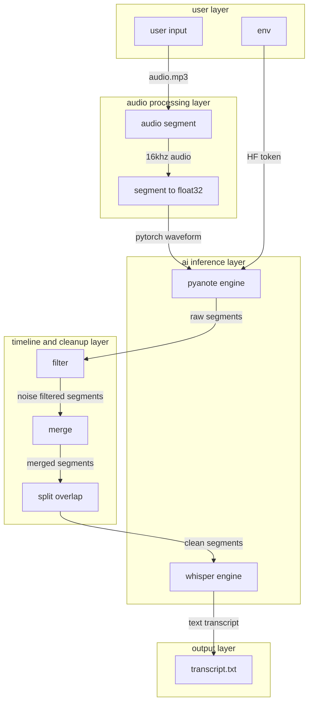

STT Architecture diagram

```mermaid
flowchart TD

subgraph user[user layer]
   input[user input]
   token[env]
end
subgraph audio processing layer[audio processing layer]
  pydub[audio segment]
  float32[segment to float32]
end

subgraph ailayer [ai inference layer]
  pyanote[pyanote engine]
  whisper[whisper engine]

end

subgraph cleanup[timeline and cleanup layer]
  filter[filter]
  merge[merge]
  split[split overlap]
end
subgraph output[output layer]
  transcript[transcript.txt]
end

input-->|audio.mp3|pydub
pydub-->|16khz audio|float32

float32-->|pytorch waveform|pyanote
token-->|HF token|pyanote

pyanote-->|raw segments|filter
filter-->|noise filtered segments|merge
merge-->|merged segments|split
split-->|clean segments|whisper

whisper-->|text transcript|transcript


```
