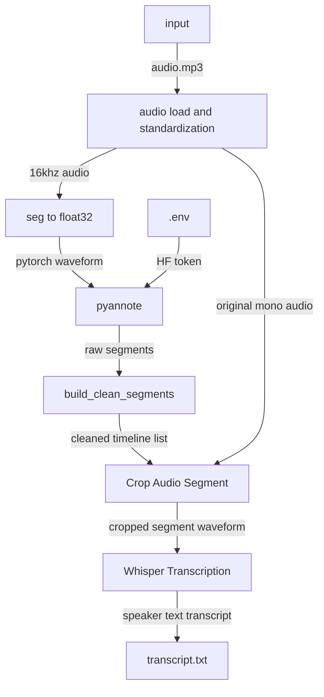

STT Data Flow Diagram

```mermaid
flowchart TD

input[input]
standardization[audio load and standardization]
normal[seg to float32]
diarization[pyannote]
env[.env]
build_clean[build_clean_segments]
crop[Crop Audio Segment]
transcribe[Whisper Transcription]
out[transcript.txt]

input-->|audio.mp3|standardization
standardization-->|16khz audio|normal
normal-->|pytorch waveform|diarization
env-->|HF token|diarization
diarization-->|raw segments|build_clean
build_clean-->|cleaned timeline list|crop
standardization-->|original mono audio|crop
crop-->|cropped segment waveform|transcribe
transcribe-->|speaker text transcript|out


```
