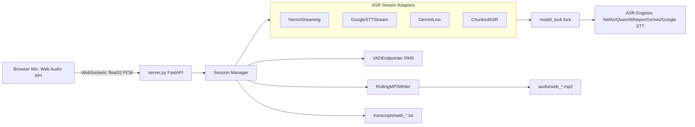
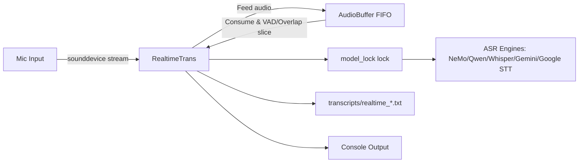
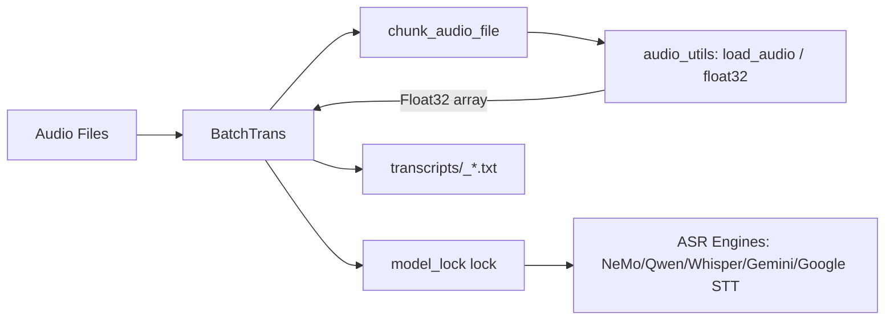
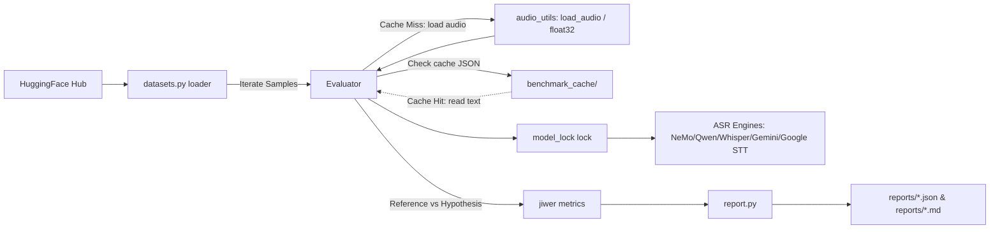

# Speech-to-Text v2 Architecture Diagrams

This document separates the project's codebase architecture into dedicated, easy-to-read diagrams for each execution pipeline.

---

## 1. Web Real-Time Server Flow (`python main.py serve`)
Handles live microphone streaming from multiple concurrent web users.

---

## 2. Local CLI Real-Time Flow (`python main.py realtime`)
Transcribes raw voice from the local computer mic directly to the command line.

---

## 3. Batch File Processing Flow (`python main.py batch <file>`)
Transcribes pre-recorded files offline, using chunking to maintain a low RAM footprint.

---

## 4. Evaluator / Benchmark Flow (`python main.py benchmark`)
Downloads datasets and evaluates model transcription accuracy (WER/CER).

