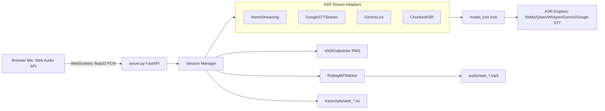

# Project Report: Real-Time Multi-Model Speech-to-Text System

This comprehensive report details the system goals, challenges, architectural design, data flows, and Speech-to-Text (ASR) engine evaluations.

---

## 1. Project Goals and Challenges

### 🎯 Project Goals
* **Multi-Backend Flexibility:** Allow dynamically switching between state-of-the-art ASR models (NVIDIA NeMo, OpenAI Whisper, Alibaba Qwen, Google Gemini, and Google Cloud STT) based on requirements like latency, cost, and language support.
* **Low-Latency Streaming:** Provide near-instantaneous transcription feedback (under 1 second) via a web browser-based interface.
* **Robust Multi-User Support:** Maintain stable concurrent connections, ensuring different users' speech streams do not interfere or cause memory/compute exhaustion.
* **Offline Resiliency & Archival:** Automatically save both high-quality audio files and timestamps in structured formats for audit and storage.

### ⚠️ Challenges and Solutions
1. **GPU Resource Contention & Locking**
   * *Challenge:* When multiple users speak simultaneously, they contend for GPU access. If multiple models are loaded or invoked concurrently, CUDA Out-Of-Memory (OOM) errors or severe execution bottlenecks occur.
   * *Solution:* Implemented a global `model_lock` in `main.py` that serializes inference requests. We also designed an **LRU Model Cache (Acyclic ASR Engine Pool)** capping active GPU models to 3. If a 4th model is requested, the oldest idle model is offloaded from VRAM.
2. **Audio Chunking and Sentence Boundary Detection**
   * *Challenge:* Cutting audio blindly every few seconds splits spoken words in half, leading to terrible transcription accuracy.
   * *Solution:* Developed a **Voice Activity Detector (VADEndpointer)** that dynamically measures Root Mean Square (RMS) energy levels. It waits for a quiet window (e.g., 600ms of silence) before cutting an audio chunk, ensuring natural sentence boundaries are maintained.
3. **Large VRAM Footprint of LLM-Based ASR**
   * *Challenge:* Models like Qwen-ASR or large Whisper variants consume massive VRAM, slowing down on mid-range GPUs.
   * *Solution:* Optimized model loading parameters (e.g., using `float16` or `int8` quantization via `faster-whisper` CTranslate2 backend), lowering memory consumption to ~800MB for Whisper and making it viable for both CPU and GPU execution.

---

## 2. Web UI Architecture

The Web interface operates as a high-performance FastAPI server communicating with the client browser via WebSockets.




### Key Architectural Components:
* **FastAPI Server (`src/server.py`):** Serves the static HTML/JS frontend and exposes the WebSocket endpoint `/ws/transcribe`.
* **Session Manager (`src/session.py`):** Isolates state for each connected browser. Each session gets its own thread-safe audio queue, VAD buffer, transcription text logger, and file writer.
* **Rolling MP3 Writer (`audio_utils.py`):** Encodes the continuous audio stream into MP3 segments on the fly, rotating files when they reach a configured size (e.g., 10MB) to prevent memory bloating.
* **LRU Model Pool:** Dynamically tracks loaded models. If a user switches from Whisper to NeMo, the backend swaps models in memory using Least Recently Used rules.

---

## 3. Data Flow

The continuous pipeline follows these distinct stages:

```
[ User Speaks ] 
      │
      ▼
[ Web Audio API ] ──► Resamples to 16kHz Mono ──► Packs into float32 Array
      │
      ▼
[ WebSocket Frame ] ──► Sent as binary packets to /ws/transcribe
      │
      ▼
[ Session Queue ] ──► Feeds into RollingMP3Writer & VADEndpointer
      │
      ▼
[ VAD Silence Check ] ──► Silence detected (>0.6s) ?
      │
      ├─► NO: Continue buffering raw float32 samples
      │
      └─► YES: Slice buffer ──► Request model_lock ──► Run Model Inference
                                                                │
                                                                ▼
[ WebSocket JSON ] ◄── Send back text string ◄── [ Transcribed Text ] ──► Write to .txt log
```

The following steps explain how speech is converted into text in the Web Real-Time Server Architecture:

* **Step 1: Audio Capture & Streaming:** The user's microphone captures voice input via the browser's HTML5 Web Audio API. The audio is resampled to 16 kHz Mono and sent continuously as raw binary `float32` PCM frames over a WebSocket connection to the FastAPI server.
* **Step 2: Session Buffering & Encoding:** The server (`src/server.py`) receives the WebSocket data and routes it to the user's active session (`src/session.py`). The audio is stored in a session queue, while the `RollingMP3Writer` simultaneously encodes and saves the continuous audio stream as rolling `.mp3` files in the `audio/` directory.
* **Step 3: Speech Detection:** The system monitors the incoming stream using a Voice Activity Detector (`VADEndpointer` in `src/asr_stream.py`). It calculates the Root Mean Square (RMS) energy to distinguish speech from silence. When it detects a pause (e.g., 0.6 seconds of silence), it marks the end of an utterance and extracts the audio chunk.
* **Step 4: Speech Recognition:** The extracted audio chunk is passed through the session's chosen ASR Stream Adapter (such as `NemoStreaming`, `GeminiLive`, or `ChunkedASRStream`). The adapter requests the global `model_lock` to serialize GPU execution and runs inference on the active ASR model from the LRU Engine Pool to convert the audio into text.
* **Step 5: Output Generation:** The transcribed text is sent back to the client browser as a JSON WebSocket frame, allowing the Web UI to display the text live with timestamps. Simultaneously, the transcript is appended and saved to a `.txt` file in the `transcripts/` directory.

---

## 4. ASR Models: Usage and Limitations

Below is the evaluation of the integrated ASR engines.

| Model Engine | Best Use Case | Latency | Why Used | Key Limitations & Constraints |
| :--- | :--- | :--- | :--- | :--- |
| **NVIDIA NeMo (Conformer-CTC)** | Real-Time Dictation / Captions | **Ultra-Low** (~80ms-150ms) | Optimized for live streaming. Processed segment-by-segment with sub-second feedback. Low computation overhead on NVIDIA GPUs. | Sensitive to strong background noise; poor accuracy for non-English speakers unless specific multi-lingual models are loaded. |
| **OpenAI Whisper (via faster-whisper)** | Offline files / Accents | **Medium** (~1s-3s chunks) | Industry standard for noise robustness, accent comprehension, and translation capabilities. Quantized (`int8`/`float16`) to fit on lower-end devices. | Not natively designed for real-time streaming; requires chunking buffers, leading to higher latency. |
| **Alibaba Qwen-ASR (Large Model)** | Contextual Meeting Transcripts | **High** (~2s-4s chunks) | It is a Large Audio-Language Model. It reads context to automatically fix grammar, stuttering, and spell homophones correctly. | Very high VRAM requirement. Can be slow to compute on standard CPUs/GPUs, increasing queuing times for concurrent users. |
| **Google Cloud STT** | Corporate / Production Scale | **Low** (Streaming API) | Offloads processing to Google Cloud. High enterprise-grade reliability and native real-time streaming support. | Requires active internet, credential files, and incurs direct API pay-per-use costs. |
| **Google Gemini (Live API)** | Complex Dialogues / Analysis | **Medium-Low** (Cloud API) | Powerful multimodal capabilities. Excels at long-form audio reasoning, summaries, and complex conversations. | High API latency fluctuations, privacy concerns with sending voice recordings to cloud servers, and API usage fees. |

### Technical Summary for Management
* Use **NVIDIA NeMo** if the primary requirement is instant live feedback with minimal latency, and you possess dedicated NVIDIA GPU servers.
* Use **OpenAI Whisper** if you need high accuracy in noisy office rooms or require multi-language translations locally without relying on the internet.
* Use **Google Cloud STT / Gemini** if you want to scale to hundreds of concurrent office workers instantly without purchasing expensive local GPU hardware, accepting the external API billing costs.

---

## 5. Key Learnings

Through the development and testing of this project, several core concepts in modern web-based audio systems were explored and mastered:

* **Audio Processing:** Understood how microphones capture sound and convert it into digital data. The raw audio is resampled to 16 kHz Mono and stored as arrays of numerical values (`float32`) so they can be parsed by machine learning models.
* **Queues and Background Processing:** Learned how to process continuous audio streams without blocking or lagging the application. High-frequency audio packets are buffered in thread-safe queues and processed asynchronously in the background.
* **Voice Activity Detection (VAD):** Mastered how the system tracks silence and voice activity. This ensures we split raw streams into cohesive chunks at natural speech pauses, rather than cutting off sentences mid-word.
* **Working with Pluggable ASR Models:** Understood how to decouple the core processing flow from the underlying AI engines. By utilizing abstract stream adapters, the server can switch between local (NeMo, Whisper, Qwen) and cloud (Gemini, Google STT) backends seamlessly.
* **WebSockets and Multi-User Support:** Gained experience in handling concurrent, bi-directional socket connections. Utilizing FastAPI WebSocket endpoints and a stateful Session Manager enables multiple users to transcribe audio concurrently in isolated execution spaces.

